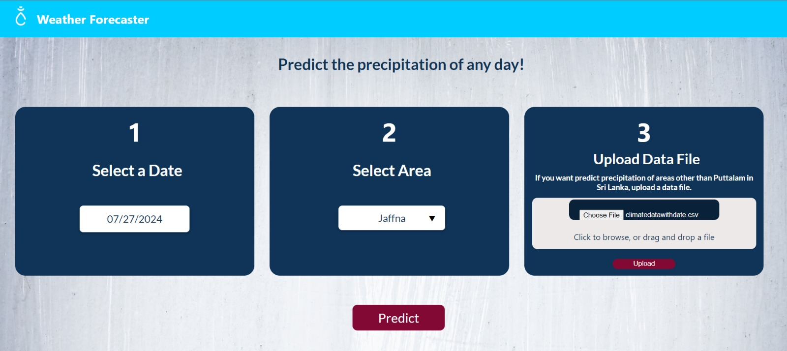
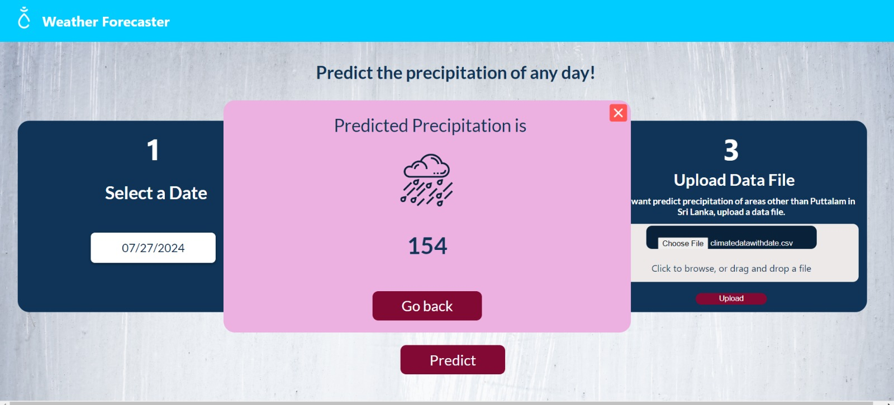

[comment]: # "This is the standard layout for the project, but you can clean this and use your own template"

# Machine Learning for Weather Forecasting

<!-- ---

This is a sample image, to show how to add images to your page. To learn more options, please refer [this](https://projects.ce.pdn.ac.lk/docs/faq/how-to-add-an-image/) -->

<!--  -->

## Team
-  E/18/242, Nimnadi J. A. S., [e18242@eng.pdn.ac.lk](e18242@eng.pdn.ac.lk)
-  E/18/368, Uduwanage H. U., [e18368@eng.pdn.ac.lk](e18368@eng.pdn.ac.lk)
-  E/18/398, Wijerathne R. M. N. S., [e18398@eng.pdn.ac.lk](e18398@eng.pdn.ac.lk)

## Table of Contents
1. [Introduction](#introduction)
2. [Other Sub Topics](#other-sub-topics)
3. [Links](#links)

---

## Introduction

 Machine learning for climate forecasting addresses the pressing real-world problem of accurately predicting and understanding climate patterns. Climate change has severe consequences on ecosystems, agriculture, and human lives. By harnessing the power of machine learning algorithms, this project aims to enhance climate models, enabling more precise and reliable forecasts. The impact is significant as it assists policymakers, researchers, and communities in making informed decisions related to disaster management, agriculture, energy, and urban planning. Improved climate forecasting can aid in mitigating the effects of climate change, minimizing risks, and promoting sustainable development, ultimately fostering a resilient and adaptive society. For this project we are mainly focused on precipitation forecasting.  

## Features

1. Select Date: Users can enter any date and easily get the prediction.
2. Select Region: User can select any wanted district to get predictions.
    For now we got the dataset relevent to Puttalam District. Otherwise if the user have relevent datasets he can upload it and get the results easily.
3. Easy Prediction 

## Dashboard

## Predictions

## Solution Architecture

## Data Flow
The prediction of Puttalam district will happen from the already uploaded dataset.
If the user wants any other district's prediction and if he have the dataset with him he can upload the data set via our system and the model will get the prediction via our trained ML model. 

## Work Flow
- Get a clear understanding of problem and problem domain
- Get the data and pre process
- Develop and test machine learning models
- Start developing the backend with Flask
- Initialize the SQLite database
- Designing and developing the frontend of the web application
- Connecting all together and testing
- Deploying

## Modeling
### Data preprocessing 
Created a target column which is a one month ahead prediction 
Checked missing values and duplicates 

### Feature selection
Checked constant, quasi-constant features
Check feature to feature correlations and dropped highly correlated redundant features 
Got important feature to the target using feature importance method

### Model selection 
#### Applied models
- Linear regression model
- Polynomial regression model
- ARMA model / ARIMA model / SARIMA model
- XGBoost regression model
- Random Forest regression model
- Holt-Winters Exponential Smoothing model
- LSTM model

#### Model evaluation
- Mean Squared Error 
- Mean Absolute Error 

Did hyper parameter tunings for models and improved the accuracy.

Choose Random Forest regression model as our final model.

## Links

- [Project Repository](https://github.com/cepdnaclk/e18-6sp-Machine-Learning-for-Weather-Forecasting)
- [Project Page](https://cepdnaclk.github.io/e18-6sp-Machine-Learning-for-Weather-Forecasting/)
- [Department of Computer Engineering](http://www.ce.pdn.ac.lk/)
- [University of Peradeniya](https://eng.pdn.ac.lk/)

[//]: # (Please refer this to learn more about Markdown syntax)
[//]: # (https://github.com/adam-p/markdown-here/wiki/Markdown-Cheatsheet)
